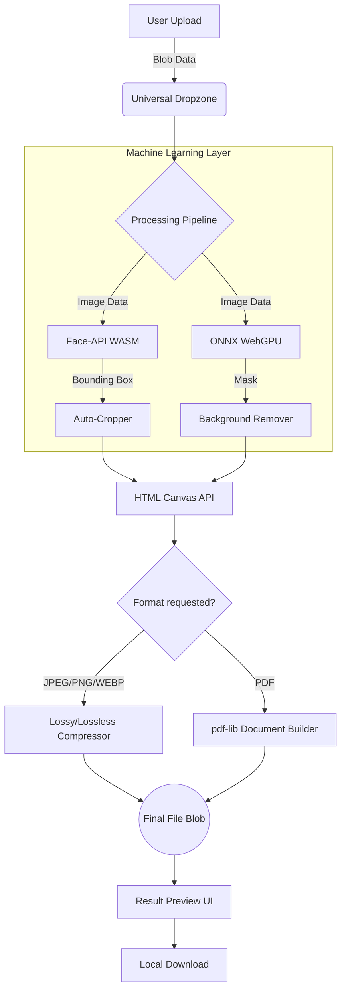

<div align="center">
  

  # 🛡️ Secure Document Auto-Resizer

  **The ultimate offline-first, browser-based Machine Learning application for perfectly formatting passports, ID cards, and exam documents.**

  [](https://reactjs.org/)
  [](https://vitejs.dev/)
  [](https://www.typescriptlang.org/)
  [](https://developer.mozilla.org/en-US/docs/Web/Progressive_web_apps)
  [](https://onnxruntime.ai/)
</div>

---

## 📖 Project Overview

**Secure Document Auto-Resizer** is a privacy-first web application designed to solve the frustrating problem of formatting strict bureaucratic documents (passports, exam forms, signatures). 

Unlike traditional web converters that upload your highly sensitive ID documents to unknown third-party servers, this application processes **100% of the data locally on your device** utilizing powerful in-browser WebAssembly (WASM) Machine Learning engines. 

It is bundled as a **Progressive Web App (PWA)**, meaning you can install it on your Desktop or Mobile device and use it completely offline, forever.

---

## ✨ In-Depth Features

### 1. 🧠 In-Browser Machine Learning (Zero Data Collection)
- **Automatic Face Detection:** Utilizes `@vladmandic/face-api` to scan your uploaded photo, identify facial landmarks, and perfectly crop the image so your head adheres to exact biometric passport standards (e.g., 70% face coverage).
- **AI Background Removal:** Employs `@imgly/background-removal` via the ONNX WebGPU runtime to surgically extract subjects from their backgrounds and replace them with perfectly solid colors (e.g., pure white or light blue for ID photos).

### 2. 🗜️ Advanced File Compression
- Deep client-side compression algorithms dynamically reduce image quality in granular increments until the final file precisely hits the required target (e.g., `< 50KB`).
- Intelligently swaps between `image/jpeg` and `image/webp` based on user selection to maximize quality at microscopic file sizes.

### 3. 📄 PDF Construction & Injection
- Converts processed images directly into strictly bounded PDF documents using `pdf-lib`.
- Features a **Multi-Image Compiler**: Select 10 different documents, compress them all to 50KB, and perfectly bind them into a single, highly compressed PDF packet.

### 4. 🎨 Multi-Modal Theming Engine
The application boasts a deeply engineered CSS custom-property theming system with four distinct visual modes:
- ☀️ **Light Mode:** Clean, high-contrast professional interface.
- 🌙 **Dark Mode:** Deep cyberpunk aesthetic with neon accents.
- 💻 **System Auto:** Dynamically morphs icons (📱/💻/🖥️) based on your device width and respects your OS color scheme.
- 🌅 **Zen Mode:** A premium, ultra-modern **Neumorphic Glassmorphism** UI featuring sweeping gradient backgrounds, translucent frosted-glass cards, and warm 3D glowing drop-shadows.

---

## 🏗️ System Architecture & Design

The application follows a strictly decoupled **Client-Side Processing Architecture**. 



### 🧱 Design Patterns Used

1. **Strategy Pattern:** The compression pipeline dynamically selects different processing strategies based on the requested output format (JPEG vs. PDF) and rule constraints without altering the core pipeline context.
2. **Observer Pattern:** React's `useEffect` deeply relies on the observer pattern, specifically listening to `window.matchMedia` to reactively update the UI when the underlying OS theme shifts.
3. **Facade Pattern:** Complex multi-step operations (loading ML models, drawing to hidden canvases, recursively compressing blobs) are hidden behind a single elegant Facade function: `processImage()`. The UI only knows it sends a file and receives a finished URL.

---

## 🛠️ Technology Stack

| Category | Technology | Purpose |
| :--- | :--- | :--- |
| **Core Framework** | React 19 + TypeScript | Strongly typed, functional UI components. |
| **Build Tool** | Vite 8 | Lightning-fast HMR and optimized production bundling. |
| **Progressive Web App** | `vite-plugin-pwa` | Service Worker generation, precaching huge ML `.wasm` models for offline execution. |
| **Machine Learning** | `onnxruntime-web` | Hardware-accelerated (WebGPU) AI execution in the browser. |
| **PDF Generation** | `pdf-lib` | Constructing and modifying PDF byte arrays in memory. |
| **Styling** | Vanilla CSS Variables | Zero-dependency, highly performant dynamic theme shifting. |

---

## 🚀 Getting Started

### Prerequisites
- Node.js (v18+ recommended)
- Git

### Installation

1. **Clone the repository:**
   ```bash
   git clone https://github.com/yourusername/secure-image-resizer.git
   cd secure-image-resizer
   ```

2. **Install Dependencies:**
   *(Note: The `--legacy-peer-deps` flag is required because Vite 8 and the PWA plugin have strict peer-dependency checks)*
   ```bash
   npm install --legacy-peer-deps
   ```

3. **Start the Development Server:**
   ```bash
   npm run dev
   ```

4. **Build for Production:**
   ```bash
   npm run build
   ```

---

## 📲 Installing as a Native App (PWA)

Because this app utilizes strict Service Workers, it can be installed natively!
1. Start the app and open it in Chrome/Edge/Safari.
2. Click anywhere on the page to register user interaction.
3. Look for the **⬇️ Install App** button next to the Zen Mode toggle, or use the browser's install icon in the URL bar.
4. Launch it directly from your computer's taskbar or phone's home screen!

---

<div align="center">
  <i>"Privacy is not an option, it's the default."</i><br>
  Built with ❤️ by a developer tired of uploading passports to sketchy websites.
</div>
