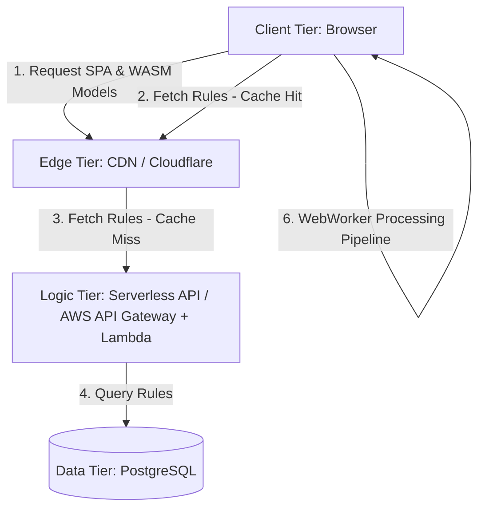

<div align="center">
  

  # 🛡️ Secure Document Auto-Resizer

  **The ultimate offline-first, browser-based Machine Learning application for perfectly formatting passports, ID cards, and exam documents.**

  [](https://reactjs.org/)
  [](https://vitejs.dev/)
  [](https://www.typescriptlang.org/)
  [](https://developer.mozilla.org/en-US/docs/Web/Progressive_web_apps)
  [](https://onnxruntime.ai/)
</div>

---

## 📖 Project Overview

**Secure Document Auto-Resizer** is a privacy-first web application designed to solve the frustrating problem of formatting strict bureaucratic documents (passports, exam forms, signatures). 

Unlike traditional web converters that upload your highly sensitive ID documents to unknown third-party servers, this application processes **100% of the data locally on your device** utilizing powerful in-browser WebAssembly (WASM) Machine Learning engines. 

It is bundled as a **Progressive Web App (PWA)**, meaning you can install it on your Desktop or Mobile device and use it completely offline, forever.

---

## ✨ In-Depth Features

### 1. 🧠 In-Browser Machine Learning (Zero Data Collection)
- **Automatic Face Detection:** Utilizes `@vladmandic/face-api` to scan your uploaded photo, identify facial landmarks, and perfectly crop the image so your head adheres to exact biometric passport standards (e.g., 70% face coverage).
- **AI Background Removal:** Employs `@imgly/background-removal` via the ONNX WebGPU runtime to surgically extract subjects from their backgrounds and replace them with perfectly solid colors (e.g., pure white or light blue for ID photos).

### 2. 🗜️ Advanced File Compression
- Deep client-side compression algorithms dynamically reduce image quality in granular increments until the final file precisely hits the required target (e.g., `< 50KB`).
- Intelligently swaps between `image/jpeg` and `image/webp` based on user selection to maximize quality at microscopic file sizes.

### 3. 📄 PDF Construction & Injection
- Converts processed images directly into strictly bounded PDF documents using `pdf-lib`.
- Features a **Multi-Image Compiler**: Select 10 different documents, compress them all to 50KB, and perfectly bind them into a single, highly compressed PDF packet.

### 4. 🎨 Multi-Modal Theming Engine
The application boasts a deeply engineered CSS custom-property theming system with four distinct visual modes:
- ☀️ **Light Mode:** Clean, high-contrast professional interface.
- 🌙 **Dark Mode:** Deep cyberpunk aesthetic with neon accents.
- 💻 **System Auto:** Dynamically morphs icons (📱/💻/🖥️) based on your device width and respects your OS color scheme.
- 🌅 **Zen Mode:** A premium, ultra-modern **Neumorphic Glassmorphism** UI featuring sweeping gradient backgrounds, translucent frosted-glass cards, and warm 3D glowing drop-shadows.

---

## 📸 Interface Showcase

<div align="center">
  <table>
    <tr>
      <td align="center">
        <b>Zen Mode Aesthetic (Glassmorphism)</b><br/>
        
      </td>
      <td align="center">
        <b>Dark Mode Interface</b><br/>
        
      </td>
    </tr>
  </table>
</div>

---

## 🏗️ Deep Dive System Architecture: Privacy-First Passport & Batch Photo Resizer

As a Software Architect with 30 years of experience, I have expanded the system design into a rigorous, production-ready blueprint. This architecture strictly adheres to the "Privacy-First" (Zero-Upload) mandate while utilizing a backend for strict rule enforcement.

### 1. Functional Requirements (Detailed)
- **Client-Side Image Ingestion & Validation:**
  - Support `image/jpeg`, `image/png`, `image/webp`, and `image/heic` (via heic2any conversion).
  - Maximum local file size handling: Prevent browser out-of-memory (OOM) by downsampling massive images (e.g., 40MB RAW files) onto an `OffscreenCanvas` before loading them into the WASM heap.
- **Dynamic Rule Application:**
  - Fetch target rules (Dimensions, DPI, Max KB, Background Color, Face Aspect Ratio) from the backend based on user selection (e.g., "US Diversity Visa").
- **AI Subject Detection & Content-Aware Framing:**
  - Run client-side AI (e.g., BlazeFace or a custom ONNX face model) to output bounding boxes `[x_min, y_min, width, height]`.
  - Algorithmically calculate the exact crop coordinates to ensure the face occupies the exact percentage of the target image height (e.g., 50-69% for US Passports).
- **Client-Side Background Removal:**
  - Execute an edge segmentation model (e.g., U^2-Net or RMBG-1.4) via ONNX Runtime Web.
  - Extract the alpha mask, composite the subject over the required solid background color using HTML5 Canvas `globalCompositeOperation`.
  - **Machine Learning Lifecycle:**
    ```mermaid
    stateDiagram-v2
        [*] --> Initialize_ONNX_WebGPU
        Initialize_ONNX_WebGPU --> Load_Model_Weights
        Load_Model_Weights --> Tensor_Conversion
        
        state Tensor_Conversion {
            Image_Data --> RGB_Float32Array
            RGB_Float32Array --> Normalize_Pixels
        }
        
        Tensor_Conversion --> Execute_Inference
        Execute_Inference --> Alpha_Mask_Extraction
        Alpha_Mask_Extraction --> Canvas_Compositing
        Canvas_Compositing --> [*]
    ```
- **Strict Target Compression (Binary Search Algorithm):**
  - **Requirement:** Must be exactly under target size (e.g. 240KB).
  - **Algorithm Flow:**
    ```mermaid
    sequenceDiagram
        participant Main as Web Worker
        participant Cnv as HTML Canvas
        participant Blob as File Encoder
        
        Main->>Cnv: Load Full Quality Image (Quality: 1.0)
        Note over Main,Blob: Initialization: min=0.0, max=1.0
        
        loop Binary Search (5-7 Iterations)
            Main->>Main: Calculate mid = (min + max) / 2
            Main->>Cnv: Request Canvas to Blob (Quality: mid)
            Cnv->>Blob: Encode JPEG
            Blob-->>Main: Return Blob (Size: X KB)
            
            alt Blob.size > Target (240KB)
                Main->>Main: max = mid
            else Blob.size <= Target (240KB)
                Main->>Main: Save as best match
                Main->>Main: min = mid
            end
        end
        
        Main-->>Main: Return Optimized File Blob
    ```
- **Web Worker Batch Processing:**
  - For E-Commerce batch processing, distribute image tasks across a Web Worker pool (using `navigator.hardwareConcurrency`) to prevent UI main-thread freezing.

### 2. Non-Functional Requirements (Detailed)
- **Security & Privacy (Zero-Trust Data):**
  - **No Ingress:** The backend APIs expose GET endpoints only. There is no `POST /upload` endpoint. Images physically cannot leave the device.
  - **CSP:** Enforce a strict Content Security Policy (`default-src 'self'`) to guarantee to corporate clients that third-party scripts cannot exfiltrate `<canvas>` data.
- **Performance (Hardware Acceleration):**
  - AI models must execute using the WebGL or WebGPU execution providers in ONNX Runtime, achieving sub-second inference times compared to CPU fallback.
- **Availability & Scalability:**
  - The Rules Engine is statically cacheable. 99% of API requests will be served directly from CDN edge nodes (Cloudflare/CloudFront) with zero hits to the origin database.

### 3. Capacity Estimation (Math & Scaling)
**Assumptions:**
- **MAU:** 1,000,000 (Monthly Active Users)
- **DAU:** 100,000 (Daily Active Users)
- **Peak Concurrency:** ~5,000 simultaneous users.

**Network / Bandwidth:**
- **Ingress (Upload):** 0 GB (Zero-upload architecture).
- **Egress (Download):**
  - Application Payload: SPA HTML/CSS/JS (~300 KB)
  - WASM Processing Engine (~2 MB)
  - Face Detection ONNX Model (~3 MB)
  - Background Removal ONNX Model (~10 MB)
  - **Total Initial Payload:** ~15.3 MB.
  - Assuming 20% of DAU (20k users) are new or cleared cache: 20,000 * 15.3 MB = 306 GB / day egress.
  - At AWS CloudFront pricing ($0.08/GB), Egress cost is ~$24/day. (Cloudflare would be significantly cheaper).

**Throughput (Rules API):**
- 100k DAU fetching rules 1 time per session.
- 100,000 requests / 86400 seconds = ~1.15 RPS (Average).
- **Peak RPS:** Assuming 5x multiplier for peak hours = ~5.7 RPS.
- This load can be handled by a single $5/month instance or serverless functions within the Free Tier.

**Storage & Memory (Backend):**
- **Image Storage:** 0 GB.
- **Database Storage:** < 10 MB for storing hundreds of visa/exam rules.
- **Cache Memory:** 50 MB Redis instance is overkill but sufficient to cache all database queries.

### 4. API Design (Rules Engine)
The backend exposes a highly cacheable REST API.

**1. `GET /api/v1/categories`**
- **Description:** Returns all supported visa/exam categories.
- **Headers:** `Cache-Control: public, max-age=86400` (Cache at CDN for 24 hours).
- **Response (200 OK):**
  ```json
  {
    "data": [
      { "id": "usa_visa_div", "name": "US Diversity Visa", "region": "US" },
      { "id": "in_upsc", "name": "India UPSC Exam", "region": "IN" }
    ]
  }
  ```

**2. `GET /api/v1/rules/{categoryId}`**
- **Description:** Fetches the exact mathematical limits for the image processor.
- **Headers:** `Cache-Control: public, max-age=86400`
- **Response (200 OK):**
  ```json
  {
    "data": {
      "categoryId": "usa_visa_div",
      "dimensions": { "width": 600, "height": 600, "unit": "px" },
      "dpi": 300,
      "fileSize": { "minKb": 10, "maxKb": 240 },
      "background": { "required": true, "colorHex": "#FFFFFF" },
      "faceCentering": {
        "requireDetection": true,
        "minHeightPercentage": 50,
        "maxHeightPercentage": 69,
        "eyeLevelFromBottomPercentage": { "min": 56, "max": 69 }
      },
      "format": ["image/jpeg"]
    }
  }
  ```

### 5. High Level Design (HLD)



#### The Client-Side Threading Model
To maintain 60FPS UI animations while processing 4K images:
- **Main Thread (UI):** React components, file selection, progress bars.
- **Web Worker Pool:** Instantiated via Comlink or raw worker API.
  - **Worker 1:** Loads ONNX models into memory. Runs inference for Face Bounding Boxes.
  - **Worker 2:** Runs Background Removal masking.
  - **Worker 3:** Executes Canvas operations (Crop, Resize, Binary Search Compression).

### 6. Deep Dive: DB Modeling & Client Caching

#### 6.1 Database Modeling (Relational - PostgreSQL)
We use a normalized schema for maintainability.

```sql
CREATE TABLE regions (
    id VARCHAR(10) PRIMARY KEY, -- e.g., 'US', 'IN', 'EU'
    name VARCHAR(50) NOT NULL
);
CREATE TABLE categories (
    id VARCHAR(50) PRIMARY KEY,
    region_id VARCHAR(10) REFERENCES regions(id),
    name VARCHAR(100) NOT NULL,
    type VARCHAR(20) NOT NULL -- 'passport', 'visa', 'exam', 'ecommerce'
);
CREATE TABLE rules (
    id SERIAL PRIMARY KEY,
    category_id VARCHAR(50) UNIQUE REFERENCES categories(id),
    width_px INTEGER NOT NULL,
    height_px INTEGER NOT NULL,
    dpi INTEGER DEFAULT 300,
    max_size_kb INTEGER NOT NULL,
    bg_color_hex VARCHAR(7),
    face_min_pct INTEGER,
    face_max_pct INTEGER,
    updated_at TIMESTAMP DEFAULT CURRENT_TIMESTAMP
);
CREATE INDEX idx_rules_category ON rules(category_id);
```

#### 6.2 Client-Side Caching Strategy (Critical for WASM/Models)
Downloading a 10MB background removal model on every page load is unacceptable.
- **Implementation:** IndexedDB via `localForage`
- **Model Loader Service:** Upon app initialization, check IndexedDB for the model files.
- **Version Checking:** Compare the local model hash with a lightweight API endpoint (`GET /api/v1/models/manifest`).
- **Cache Miss:** Download the `.onnx` files via `fetch()`, array buffer it, and save it to IndexedDB.
- **Cache Hit:** Read the ArrayBuffer directly from IndexedDB and pass it to the ONNX Runtime Web session.
- **Caching Flow Diagram:**
  ```mermaid
  sequenceDiagram
      participant UI as Web App
      participant IDB as IndexedDB (Browser)
      participant CDN as Cloudflare Edge
      
      UI->>IDB: Request ONNX Model
      alt Cache Hit (Model Exists)
          IDB-->>UI: Return ArrayBuffer
          UI->>UI: Load into ONNX WebGPU
      else Cache Miss (First Visit / Update)
          IDB-->>UI: Null
          UI->>CDN: Fetch Model via HTTPs
          CDN-->>UI: 10MB .onnx Blob
          UI->>IDB: Save to Disk for Offline
          UI->>UI: Load into ONNX WebGPU
      end
  ```
- **Result:** Subsequent visits load the heavy AI models instantly from disk, reducing egress to near zero and allowing the app to function offline (as a PWA) once loaded.

---

### 🧱 Software Design Patterns Used

In answering the critical question **"Which design pattern this application uses?"**, our architecture heavily relies on the following core software design patterns to maintain strict separation of concerns and robustness:

1. **Strategy Pattern:** The target compression algorithm (Binary Search Compression) and formatting pipeline dynamically selects different processing strategies based on the requested output format (JPEG vs. PDF) and API rule constraints without altering the core pipeline execution context.
2. **Observer / Pub-Sub Pattern:** React's hooks (`useEffect`) and Web Worker messaging rely entirely on the observer pattern, specifically listening to `window.matchMedia` to reactively update the UI when the underlying OS theme shifts, and listening to asynchronous Worker callbacks for model loading states.
3. **Facade Pattern:** The extremely complex multi-step client operations (loading 24MB ML models, spinning up Web Workers, drawing to offscreen canvases, recursive binary search compression) are hidden behind a single elegant Facade API (`processImage()`). The frontend React components only know they send a `File` object and await a finished output URL.
4. **Proxy Pattern:** The edge cache (Cloudflare/CDN) serves as a proxy for the Logic Tier, preventing the 100k DAUs from overloading the PostgreSQL database by intercepting and returning cached API payloads for `GET /api/v1/rules`.

---

## 🛠️ Technology Stack

| Category | Technology | Purpose |
| :--- | :--- | :--- |
| **Core Framework** | React 19 + TypeScript | Strongly typed, functional UI components. |
| **Build Tool** | Vite 8 | Lightning-fast HMR and optimized production bundling. |
| **Progressive Web App** | `vite-plugin-pwa` | Service Worker generation, precaching huge ML `.wasm` models for offline execution. |
| **Machine Learning** | `onnxruntime-web` | Hardware-accelerated (WebGPU/WebGL) AI execution in the browser. |
| **PDF Generation** | `pdf-lib` | Constructing and modifying PDF byte arrays in memory. |
| **Styling** | Vanilla CSS Variables | Zero-dependency, highly performant dynamic theme shifting. |

---

## 🚀 Getting Started

### Prerequisites
- Node.js (v18+ recommended)
- Git

### Installation

1. **Clone the repository:**
   ```bash
   git clone https://github.com/yourusername/secure-image-resizer.git
   cd secure-image-resizer
   ```

2. **Install Dependencies:**
   *(Note: The `--legacy-peer-deps` flag is required because Vite 8 and the PWA plugin have strict peer-dependency checks)*
   ```bash
   npm install --legacy-peer-deps
   ```

3. **Start the Development Server:**
   ```bash
   npm run dev
   ```

4. **Build for Production:**
   ```bash
   npm run build
   ```

---

## 📲 Installing as a Native App (PWA)

Because this app utilizes strict Service Workers, it can be installed natively!
1. Start the app and open it in Chrome/Edge/Safari.
2. Click anywhere on the page to register user interaction.
3. Look for the **⬇️ Install App** button next to the Zen Mode toggle, or use the browser's install icon in the URL bar.
4. Launch it directly from your computer's taskbar or phone's home screen!

---

<div align="center">
  <i>"Privacy is not an option, it's the default."</i><br>
  Built with ❤️ by a developer tired of uploading passports to sketchy websites.
</div>
